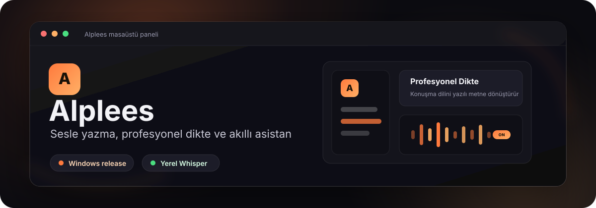

  

  
  
  
  

<h3 align="center">Konuşmanı yakalar, metne dönüştürür, yazı diline taşır.</h3>

  Alplees; koyu, sakin ve hızlı bir masaüstü deneyimi içinde sesli yazma,
  profesyonel dikte, çeviri, özel sözlük ve asistan akışlarını bir araya getirir.

  

## Alplees Ne Yapar?

| Özellik | Açıklama |
| --- | --- |
| **Sesle Yazma** | Konuşmanı yerel Whisper akışıyla metne dönüştürür. |
| **Profesyonel Dikte** | Dağınık konuşma dilini daha okunur ve düzenli yazı diline taşır. |
| **Normal / Doğal Mod** | Cümle yapısını bozmadan hafif temizlik ve noktalama yapar. |
| **Akıllı Sözlük** | Özel terimleri, marka adlarını ve teknik ifadeleri daha doğru korur. |
| **Onaylı Öğrenme** | Yeni terimleri otomatik fark eder, sözlüğe eklemeden önce kullanıcıya sorar. |
| **Asistan** | Seçili metni düzenleme, ekrandaki durumu anlama ve pratik yanıt üretme akışlarını destekler. |

## Son Sürümde Öne Çıkanlar

`v0.2.3`, profesyonel dikte ve akıllı sözlük davranışını daha güvenilir hale getirir:

- Profesyonel mod artık soru, itiraz, talep ve örnek verme niyetini korur; soruları cevap gibi kesin hükme çevirmemesi için güçlendirildi.
- Özellik ve kısayol anlatımlarında eşleştirme korunur; bir özelliğin kısayolu başka bir özelliğe taşınmaz.
- Sözlük terimleri yalnızca metinde bağlamı varsa düzeltme için kullanılır; sözlükteki kelimelerin çıktıya sızması engellendi.
- OpenRouter gibi yerleşik teknik terimler artık tekrar tekrar "sözlüğe ekleyeyim mi?" önerisi üretmez.
- Kullanıcının dikte sonrası yaptığı özel terim düzeltmelerini yakalama akışı iyileştirildi.
- Uzun profesyonel diktelerde içerik kaybı riskini azaltmak için çıktı bütçesi ve yerel model bağlamı artırıldı.
- Asistan, aktif tarayıcı URL'sini ve TikTok video kimliğini bağlam olarak algılayabilecek ilk altyapıya kavuştu.

## İndir

En güncel Windows kurulum dosyası GitHub Releases üzerinden yayınlanır:

  

## Görsel Kimlik

Alplees arayüzü koyu zemin, yumuşak panel ayrımları ve sıcak turuncu vurgular üzerine kurulur.

| Rol | Renk |
| --- | --- |
| Ana zemin | `#0b0b10` |
| Panel | `#14141c` |
| İkincil panel | `#1c1c28` |
| Ana vurgu | `#ff7a3d` |
| Sıcak vurgu | `#ffb066` |
| Metin | `#f3f3f7` |

## Not

> Sesle yazma uygulaması. Bu repo uygulama kaynak kodunu değil, sürüm (release) dosyalarını barındırır.
> Kurulum dosyaları, blockmap ve otomatik güncelleme metadata dosyaları GitHub Releases üzerinden yayınlanır.
